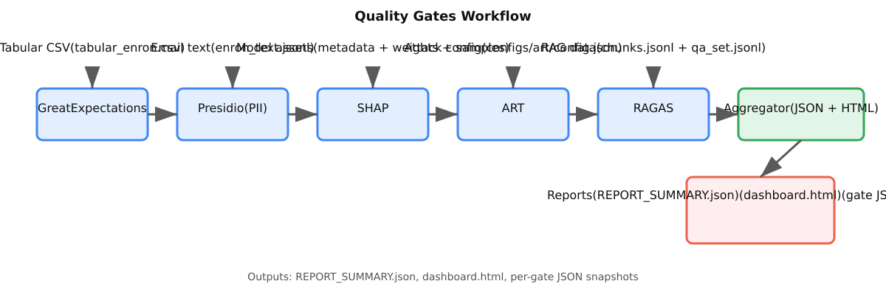

# Pipeline v2.4 Toolchain

This repository packages five independent quality gates – data validation, PII scanning, model explainability, adversarial robustness, and retrieval evaluation – plus a final report aggregator. Every gate runs inside its own Docker container and consumes artifacts from the `artifacts/` folder while producing JSON reports under `reports/`.

## Prerequisites

* Docker and Docker Compose v2

## Repository Layout

```
artifacts/
  data/
    tabular/tabular_enron.csv        # GE input sample
    text/enron_text.jsonl            # Presidio input sample
    rag_chunks/chunks.jsonl          # RAGAS knowledge base sample
    qa/qa_set.jsonl                  # RAGAS question/answer sample
    models/mnist_samples.json        # Reference inputs for SHAP/ART gates
  models/
    classifier/
      metadata.json                  # Model description shared by SHAP/ART
      mnist_cnn_weights.json         # Lightweight linear model weights
    vector_index/index.faiss         # Placeholder FAISS index
configs/
  art/config.json                    # FGSM/PGD parameters for the ART gate
reports/
  ...                                # JSON outputs written by each gate
```

## Usage

1. Populate the `artifacts/` folders with your data, model, and index assets. The repository ships with lightweight samples so the pipeline can run end-to-end without external downloads.
2. Run the full pipeline locally (no Docker required) using the lightweight Python entrypoints:

   ```bash
   python run_pipeline.py
   ```

   Each gate runs independently and the aggregated report is refreshed at the end of the run.

   To run with the versioned pipeline configuration, point the runner at the JSON config file:

   ```bash
   python scripts/run_pipeline.py --config configs/pipeline.config.json
   ```

   You can override the enabled gates by passing a comma-separated list (this ignores the config list):

   ```bash
   python scripts/run_pipeline.py --config configs/pipeline.config.json --gates "pii_scan,rag_eval"
   ```

   Gate names map to IDs as follows: `data_quality` → GE, `pii_scan` → Presidio, `explainability` → SHAP,
   `robustness` → ART, and `rag_eval` → RAGAS. Thresholds in `configs/pipeline.config.json` control the
   pass/fail rules for each gate and are consumed by the aggregator during report generation. If a gate is
   enabled but its report is missing, the aggregator marks it as **fail** with a "Report missing" detail.

3. (Optional) You can still orchestrate the original Docker services via `docker compose up --build` if you prefer container isolation.

4. When the run completes, inspect the individual reports under `reports/**`, the consolidated `REPORT_SUMMARY.json` at the repository root, and the HTML dashboard at `reports/dashboard/index.html` for a quick pass/fail snapshot.
   * The pipeline also records per-gate timings plus the end-to-end runtime in `reports/timings.json` so you can spot slow stages.

### Scenario-based experiments

Run deterministic scenarios without manually editing datasets or model artifacts. Each scenario creates a dedicated
working directory under `runs/<timestamp>/<scenario>/` with isolated inputs and output artifacts.

```bash
python scripts/run_scenario.py --scenario baseline --config configs/pipeline.config.json
python scripts/run_scenario.py --scenario pii_injection --config configs/pipeline.config.json
```

Scenario outputs are stored in `runs/.../artifacts/` and include all gate reports plus `REPORT_SUMMARY.json` and the
HTML dashboard. Each run also writes `runs/.../scenario_metadata.json` with the injected parameters, input paths, and
the gates expected to fail. Scenario parameters (such as row ratios) live under the `scenarios` section of
`configs/pipeline.config.json`.

### Workflow snapshot

The end-to-end orchestration is summarized in the static diagram below so you can see how every gate feeds the aggregator and final outputs at a glance. The SVG lives at `docs/workflow.svg` for offline viewing or embedding in downstream docs.



### CI workflow (all gates together)

The GitHub Actions automation is consolidated into a single workflow named **Quality Gates** that runs every gate end-to-end and uploads the combined artifacts. It triggers on `push`, `pull_request`, and manual `workflow_dispatch` so you can exercise the full pipeline on demand.

| Workflow | What runs | Artifact name |
| --- | --- | --- |
| `Quality Gates` | Great Expectations, Presidio, SHAP, ART, RAGAS, and the aggregator/dashboard | `quality-gates-reports` |

Each run installs the gate dependencies, executes `python run_pipeline.py`, and publishes the JSON/HTML reports (including `REPORT_SUMMARY.json` and `reports/timings.json`) alongside a job summary in the Actions UI. The summary renders a Mermaid pipeline with colored pass/fail nodes for every gate, lists per-gate durations and the total runtime, and links to the uploaded artifacts.

Because the workflow now records both the pipeline timer (only the gate/aggregator Python steps) and the overall wall-clock time, the job summary also shows a "Setup & overhead" row that captures checkout, dependency installation, and artifact upload time. That explains why per-gate durations are fractions of a second while the entire GitHub Action can take a couple of minutes end-to-end.

### SHAP & ART Defaults

The SHAP and ART gates evaluate a bundled MNIST-style linear classifier using real weights and a small reference set stored under `artifacts/models/classifier/mnist_cnn_weights.json` and `artifacts/data/models/mnist_samples.json`. The explainability step computes mean absolute SHAP contributions from those samples, while the robustness gate launches FGSM and PGD perturbations against the same model. Override the inputs and optional metadata/configuration via the `SHAP_*` and `ART_*` environment variables when supplying your own model artifacts.

### Gate data coverage, formats, and transformations

Each gate consumes a well-defined slice of the sample artifacts so you can trace exactly which inputs power every report:

| Gate | Primary inputs | How the data is used |
| --- | --- | --- |
| Great Expectations | `artifacts/data/tabular/tabular_enron.csv` | Loads all columns from the CSV (message metadata) to validate non-null constraints, enforce ISO timestamp formatting for `sent_at`, verify `message_id` uniqueness, and restrict `has_attachment` to `true/false`. |
| Presidio | `artifacts/data/text/enron_text.jsonl` | Reads every JSONL row, concatenates the `subject` and `body` fields into a single string per message, detects EMAIL/PHONE/NAME entities with regex recognizers, and emits anonymized samples for any hits. |
| SHAP | `artifacts/models/classifier/metadata.json`, `artifacts/models/classifier/mnist_cnn_weights.json`, `artifacts/data/models/mnist_samples.json` | Loads the classifier metadata to capture model context, ingests the linear weights/biases, and processes all reference feature vectors to compute baseline-adjusted, probability-weighted mean absolute SHAP importances. |
| ART | `artifacts/models/classifier/metadata.json`, `artifacts/models/classifier/mnist_cnn_weights.json`, `artifacts/data/models/mnist_samples.json`, `configs/art/config.json` | Uses the same model artifacts plus FGSM/PGD settings to score clean accuracy over the reference samples, generate adversarial perturbations per the config, and measure accuracy drops under each attack. |
| RAGAS | `artifacts/data/rag_chunks/chunks.jsonl`, `artifacts/data/qa/qa_set.jsonl` | Loads all knowledge chunks and QA pairs, aligns each question with its referenced chunk IDs, checks whether gold answers appear in the retrieved context text, and summarizes support, coverage, and context count metrics without collapsing them into a single score. |

The following reference snippets show exactly how the bundled datasets are shaped. Replace them with your own assets while keeping the same structure so the gates continue to parse successfully.

### Detailed dataset contents and detection logic

#### Great Expectations (Data validation)
* **Dataset content**
  * File: `artifacts/data/tabular/tabular_enron.csv`.
  * Columns: `message_id` (string), `from` (email), `to` (email), `subject` (short text), `sent_at` (timestamp as `YYYY-MM-DD HH:MM:SS`), `has_attachment` (`true`/`false`).
  * Records: three mock Enron-style messages that include IDs `ENR-001` to `ENR-003` and a mix of attachment flags.
* **Detection method**
  * Loads the CSV with pandas.
  * Enforces non-null checks on every column, `message_id` uniqueness, ISO timestamp parsing on `sent_at`, and Boolean domain checks on `has_attachment`.
  * Fails the gate if any expectation is violated.

#### Presidio (PII scanning)
* **Dataset content**
  * File: `artifacts/data/text/enron_text.jsonl`.
  * Each JSON line holds `message_id`, `subject`, and `body`; the first row embeds a U.S. phone number to guarantee at least one hit.
* **Detection method**
  * Concatenates `subject` + `body` for each record.
  * Runs regex-based recognizers for EMAIL, PHONE, and NAME tokens.
  * Emits a JSON report with per-entity hit counts, a `total_entities` aggregate so the dashboard can display how many privacy events were found, and up to three anonymized snippets per entity type; gate passes only when **no** entities are detected (any hit fails).

#### SHAP (Model explainability)
* **Dataset content**
  * Files: `artifacts/models/classifier/metadata.json`, `artifacts/models/classifier/mnist_cnn_weights.json`, and `artifacts/data/models/mnist_samples.json`.
  * Metadata exposes the classifier name, architecture, class count, and `1×4×4` input dimensions.
  * Weight file stores 10 linear weight rows with 16 coefficients each plus per-class biases.
  * Samples JSON contains flattened feature vectors (`features`), integer labels, and optional probability priors.
* **Detection method**
  * Reconstructs logits from the linear weights and every reference feature vector.
  * Uses the mean of the sample set as the SHAP baseline and computes mean absolute contributions per class, normalized via softmax.
  * Validates that normalized importances sum to 1 (±0.01) and emits `reports/shap/global.json` with class-level scores.

#### ART (Adversarial robustness)
* **Dataset content**
  * Shares the metadata, weights, and sample set listed above for SHAP, plus FGSM/PGD parameters from `configs/art/config.json` (`epsilon`, `epsilon_step`, `max_iter`).
* **Detection method**
  * Evaluates clean accuracy of the reference samples using the bundled classifier.
  * Generates FGSM perturbations using the configured epsilon, and PGD perturbations using epsilon/step/iteration settings.
  * Computes adversarial accuracies and drops; gate passes when FGSM and PGD accuracies are both ≥ 0.70.

#### RAGAS (Retrieval assessment)
* **Dataset content**
  * Knowledge base file: `artifacts/data/rag_chunks/chunks.jsonl` with `chunk_id` and `text` describing Enron’s HQ and bankruptcy timeline.
  * QA file: `artifacts/data/qa/qa_set.jsonl` with `question_id`, `question`, `answers` (list of gold strings), and `contexts` (chunk IDs that should answer the question).
* **Detection method**
  * Aligns each QA pair with its referenced chunk text.
  * Applies a lexical “LLM-as-a-judge” proxy by searching for every gold answer string within the concatenated context text.
  * Writes per-question support/coverage metrics and separate summary averages for support, context coverage, and contexts-per-question; gate passes if both mean support and mean coverage are ≥ 0.60.
* **What it measures (quick view)**
  * **Support**: For each question, whether any referenced chunk text literally contains a gold answer string (1.0 if found, 0.0 if not), then averaged across questions.
  * **Context coverage**: Whether every chunk ID listed for a question exists and was included in evaluation (1.0 if all present, 0.0 if any missing), then averaged.
  * **Contexts per question**: The average number of chunks associated with each QA pair to illuminate retrieval breadth; reported but not used for pass/fail.

#### Great Expectations sample CSV

```csv
message_id,from,to,subject,sent_at,has_attachment
ENR-001,alice@example.com,bob@example.com,Quarterly Update,2001-06-18 09:12:00,false
ENR-002,carol@example.com,finance@example.com,Meeting Follow-up,2001-06-19 14:35:48,true
ENR-003,dave@example.com,legal@example.com,Contract Review,2001-06-21 08:05:11,false
```

#### Presidio sample JSONL

Each line is an object with a `message_id` plus `subject`/`body` strings. The scanner concatenates the two text fields before running recognizers.

```json
{"message_id": "ENR-001", "subject": "Quarterly Update", "body": "Call me at 713-555-0102 when you land."}
{"message_id": "ENR-002", "subject": "Meeting Follow-up", "body": "Thanks for the quick recap."}
{"message_id": "ENR-003", "subject": "Contract Review", "body": "Please confirm the redlines."}
```

#### SHAP & ART model metadata

`artifacts/models/classifier/metadata.json` exposes classifier details consumed by both gates.

```json
{
  "name": "mnist_demo",
  "architecture": "linear_mnist_demo",
  "input_shape": [1, 4, 4],
  "num_classes": 10,
  "description": "Lightweight linear classifier for demo purposes"
}
```

#### SHAP & ART weight matrix

`artifacts/models/classifier/mnist_cnn_weights.json` stores per-class coefficients and biases for the synthetic classifier.

```json
{
  "weights": [[0.12, -0.04, ... 16 total values per class ...], ... 10 classes ...],
  "biases": [0.01, -0.07, 0.05, ...]
}
```

#### SHAP & ART reference samples

`artifacts/data/models/mnist_samples.json` contains the flattened feature vectors and optional class probabilities used as baseline inputs.

```json
{
  "features": [[0.0, 0.1, 0.2, 0.0, ... 16 values ...], [0.05, 0.0, ...]],
  "labels": [7, 2, 1, 0, ...],
  "probabilities": [[0.01, 0.03, ...], ...]
}
```

#### ART attack configuration

`configs/art/config.json` defines the FGSM and PGD hyperparameters applied to the reference samples.

```json
{
  "fgsm": {"epsilon": 0.2},
  "pgd": {"epsilon": 0.3, "epsilon_step": 0.05, "max_iter": 10}
}
```

#### RAGAS knowledge base fragments

`artifacts/data/rag_chunks/chunks.jsonl` holds retrieval passages keyed by `chunk_id`.

```json
{"chunk_id": "chunk-001", "text": "Enron Corporation was an American energy company based in Houston."}
{"chunk_id": "chunk-002", "text": "The company filed for bankruptcy in December 2001 after an accounting scandal."}
```

#### RAGAS QA pairs

`artifacts/data/qa/qa_set.jsonl` links questions to chunk identifiers and gold answers used for support scoring.

```json
{
  "question_id": "q-001",
  "question": "Where was Enron headquartered?",
  "answers": ["Houston"],
  "contexts": ["chunk-001"]
}
{
  "question_id": "q-002",
  "question": "When did Enron declare bankruptcy?",
  "answers": ["December 2001"],
  "contexts": ["chunk-002"]
}
```

### Configuration reference

The gates are lightweight Python scripts that honor environment variables so you can redirect inputs, tweak parameters, and change report locations without editing code. The following table lists the relevant settings and their defaults:

| Gate | Environment variables | Default | Purpose |
| --- | --- | --- | --- |
| Great Expectations | `GE_INPUT` | `artifacts/data/tabular/tabular_enron.csv` | Path to the CSV file that will be validated. |
|  | `GE_OUTPUT` | `reports/ge/summary.json` | Where the expectation summary is written. |
| Presidio | `PRESIDIO_INPUT` | `artifacts/data/text/enron_text.jsonl` | JSONL source of emails to scan (subject + body). |
|  | `PRESIDIO_OUTPUT` | `reports/presidio/redaction_summary.json` | Destination for the entity counts and anonymized examples. |
| SHAP | `SHAP_METADATA` | `artifacts/models/classifier/metadata.json` | Optional override describing the model (name, architecture, class count). |
|  | `SHAP_WEIGHTS` | `artifacts/models/classifier/mnist_cnn_weights.json` | Linear weights/biases consumed when computing importance scores. |
|  | `SHAP_REFERENCE` | `artifacts/data/models/mnist_samples.json` | Reference feature vectors and labels that anchor SHAP calculations. |
|  | `SHAP_OUTPUT` | `reports/shap/global.json` | Location for the global mean absolute SHAP report. |
| ART | `ART_METADATA` | `artifacts/models/classifier/metadata.json` | Model description used in the robustness report metadata. |
|  | `ART_WEIGHTS` | `artifacts/models/classifier/mnist_cnn_weights.json` | Weights and biases for the classifier under attack. |
|  | `ART_REFERENCE` | `artifacts/data/models/mnist_samples.json` | Clean evaluation samples that attacks are generated from. |
|  | `ART_CONFIG` | `configs/art/config.json` | JSON payload defining FGSM/PGD parameters (`epsilon`, `epsilon_step`, `max_iter`). |
|  | `ART_OUTPUT` | `reports/art/robustness.json` | Path for the robustness summary (clean/adv accuracy + drops). |
| RAGAS | `RAGAS_CHUNKS` | `artifacts/data/rag_chunks/chunks.jsonl` | Knowledge base fragments referenced by QA items. |
|  | `RAGAS_QA` | `artifacts/data/qa/qa_set.jsonl` | Question/answer pairs with chunk identifiers. |
|  | `RAGAS_DETAIL` | `reports/ragas/per_question.jsonl` | Detailed per-question support output. |
|  | `RAGAS_SUMMARY` | `reports/ragas/summary.json` | Aggregate retrieval support statistics. |
| Aggregator | `REPORT_GE`, `REPORT_PRESIDIO`, `REPORT_SHAP`, `REPORT_ART`, `REPORT_RAGAS` | defaults to corresponding `reports/**` paths | Allows pointing the aggregator at custom report locations if they were generated elsewhere. |
|  | `AGGREGATOR_OUTPUT` | `REPORT_SUMMARY.json` | Where the consolidated JSON snapshot is written. |
|  | `DASHBOARD_OUTPUT` | `reports/dashboard/index.html` | Destination for the HTML pass/fail dashboard. |
|  | `DASHBOARD_GATES_DIR` | `reports/dashboard/gates` | Folder that receives per-gate status JSON summaries. |

All environment variables can be set when calling `python run_pipeline.py` (e.g. `GE_INPUT=/tmp/data.csv python run_pipeline.py`) or passed through `docker compose` via the corresponding service definitions.

### Individual Containers

Each service can be run independently. Example for Great Expectations:

```bash
docker compose run --build ge
```

All containers accept environment variables (see `docker-compose.yml`) so you can override input and output locations without editing the images.

## Outputs

* `reports/ge/summary.json` – Great Expectations validation statistics
* `reports/presidio/redaction_summary.json` – Presidio entity counts, `total_entities`, and redaction examples
* `reports/shap/global.json` – Mean absolute SHAP contributions
* `reports/art/robustness.json` – Clean vs. adversarial accuracies
* `reports/ragas/*.json[l]` – Retrieval support metrics per question and summary
* `reports/dashboard/gates/*.json` – Pass/fail snapshots for each gate (mirrors dashboard rows)
* `reports/dashboard/index.html` – Human-friendly overview of gate status and pass criteria
* `REPORT_SUMMARY.json` – Aggregated snapshot across all gates, including structured pass/fail metadata

### Dashboard Pass Criteria

The dashboard summarizes each gate using the following success checks:

| Gate | Pass Criteria |
| --- | --- |
| Great Expectations | All configured expectations succeed. |
| Presidio | No PII entities are detected in the sample; any hit fails. |
| SHAP | Mean absolute importance scores sum to 1.0 (±0.01). |
| ART | FGSM and PGD adversarial accuracies remain ≥ 0.70. |
| RAGAS | Mean support **and** mean context coverage scores each meet or exceed 0.60. |

### RAGAS scoring without an external LLM

The bundled RAGAS script keeps the evaluation entirely offline. Instead of calling a hosted "LLM as a Judge" endpoint, it
computes lexical support scores by checking whether each gold answer string appears in the retrieved context snippets. This
deterministic heuristic mimics the spirit of a grounding check without network calls, which makes the demo safe to run in CI
or air-gapped environments. Supplying a custom RAGAS configuration or model-backed judge is still possible—override the entry
point with your own implementation if you need true LLM-based scoring.

## Continuous Integration

Every push and pull request triggers the **Run Quality Gates Pipeline** GitHub Action, now split into four coordinated jobs that run independently before aggregation:

1. **data / GE + Presidio** – runs the table validations and PII scan and publishes their JSON reports as an artifact.
2. **model / SHAP** – runs the explainability gate on the bundled classifier and uploads `reports/shap/global.json`.
3. **predeploy / RAGAS + ART** – evaluates retrieval support plus adversarial robustness and uploads their reports.
4. **aggregate / consolidate results** – waits for the three artifacts, runs the aggregator to rebuild `REPORT_SUMMARY.json`
   and the dashboard, and posts the run status into the job summary.

The aggregate job uploads `REPORT_SUMMARY.json` and `reports/dashboard/index.html` as artifacts and also renders a Markdown
table plus a DevOps-style Mermaid diagram (trigger → checkout/setup → data/model/predeploy fan-out → aggregator → reports)
directly into the job summary so you can see gate outcomes without downloading files. Artifacts remain available if you want
to inspect the structured JSON or open the dashboard locally. Look for an artifact named **`pipeline-summary`** (contains
`REPORT_SUMMARY.json`, the dashboard HTML, and per-gate status JSON), alongside **`data-gates`**, **`shap-gate`**, and
**`predeploy-gates`** for the raw gate outputs.

## Extending

* Update expectation logic in `docker/ge/run_expectations.py` for domain-specific validations.
* Customize Presidio recognizers or anonymizers inside `docker/presidio/run_presidio.py`.
* Swap in a trained model by updating the classifier metadata, weights, and sample set under `artifacts/models/classifier/` and `artifacts/data/models/`. The SHAP and ART gates assume a 10-class MNIST-style classifier by default, but you can override paths and settings via environment variables (see `docker/shap/run_shap.py` and `docker/art/run_art.py`).
* Provide a real FAISS index and larger QA/chunk datasets to align with your RAG deployment.

## License

This repository is provided as-is for demonstration and can be adapted to suit internal pipelines.
